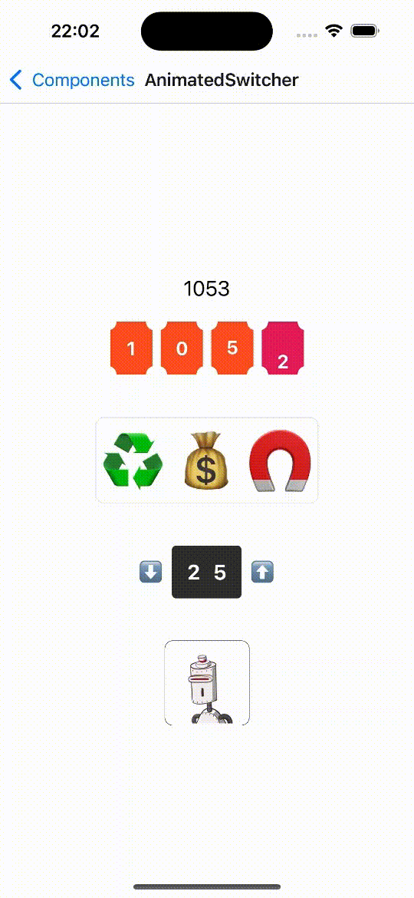

# rn-custom-components

This project showcases a collection of custom UI components created by me.

## Overview

This repository contains a set of reusable custom UI components built for React Native. These components are designed to provide a consistent and delightful user experience across your React Native applications.

## How to start

    1. Clone the project repository:

    ```bash
    git clone https://github.com/hexboy/rn-custom-components.git

    2. yarn

    3. yarn start

## AnimatedSwitcher component


